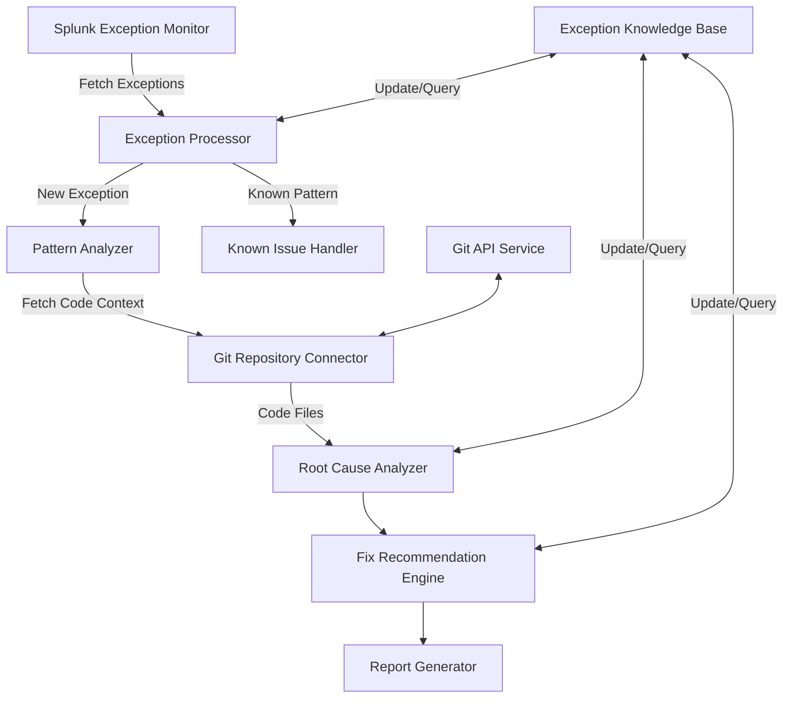

```mermaid
flowchart TD
    A[Splunk Exception Monitor] -->|Fetch Exceptions| B[Exception Processor]
    B -->|New Exception| C[Pattern Analyzer]
    B -->|Known Pattern| D[Known Issue Handler]
    C -->|Fetch Code Context| E[Git Repository Connector]
    E -->|Code Files| F[Root Cause Analyzer]
    F --> G[Fix Recommendation Engine]
    G --> H[Report Generator]
    I[Exception Knowledge Base] <-->|Update/Query| B
    I <-->|Update/Query| F
    I <-->|Update/Query| G
    J[Git API Service] <--> E
```